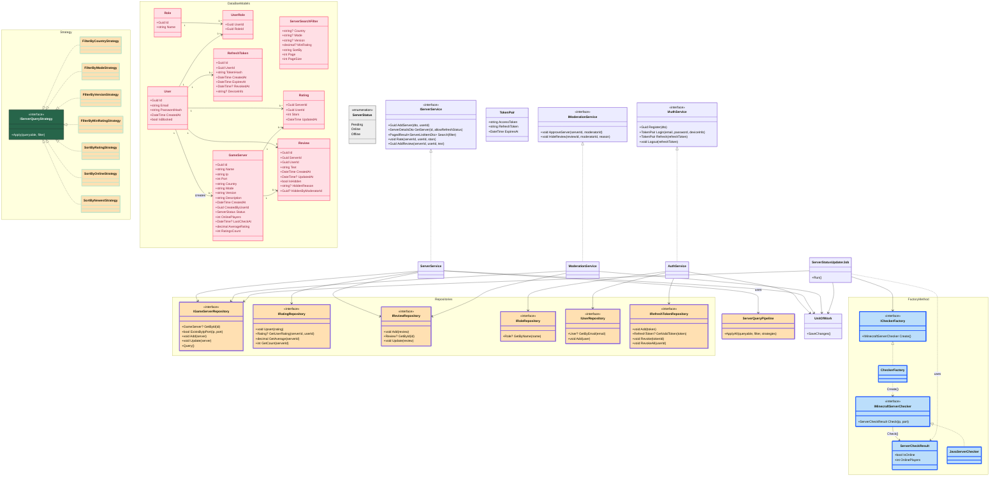

```mermaid
classDiagram
direction TB
namespace Repositories {
class IGameServerRepository {
+GameServer? GetById(id)
+bool ExistsByIpPort(ip, port)
+void Add(server)
+void Update(server)
+Query()
}

        class IRatingRepository {
            +void Upsert(rating)
            +Rating? GetUserRating(serverId, userId)
            +decimal GetAverage(serverId)
            +int GetCount(serverId)
        }

        class IReviewRepository {
            +void Add(review)
            +Review? GetById(id)
            +void Update(review)
        }

        class IRoleRepository {
            +Role? GetByName(name)
        }

        class IUserRepository {
            +User? GetByEmail(email)
            +void Add(user)
        }

        class IRefreshTokenRepository {
            +void Add(token)
            +RefreshToken? GetValidToken(token)
            +void Revoke(tokenId)
            +void RevokeAll(userId)
        }

    }
    namespace Strategy {
        class IServerQueryStrategy {
            +Apply(queryable, filter)
        }

        class FilterByCountryStrategy {
        }

        class FilterByModeStrategy {
        }

        class FilterByVersionStrategy {
        }

        class FilterByMinRatingStrategy {
        }

        class SortByRatingStrategy {
        }

        class SortByOnlineStrategy {
        }

        class SortByNewestStrategy {
        }

    }
    namespace FactoryMethod {
        class ICheckerFactory {
            +IMinecraftServerChecker Create()
        }

        class CheckerFactory {
        }

        class IMinecraftServerChecker {
            +ServerCheckResult Check(ip, port)
        }

        class ServerCheckResult {
            +bool IsOnline
            +int OnlinePlayers
        }

        class JavaServerChecker {
        }

    }
    namespace DataBseModels {
        class ServerSearchFilter {
            +string? Country
            +string? Mode
            +string? Version
            +decimal? MinRating
            +string SortBy
            +int Page
            +int PageSize
        }

        class Role {
            +Guid Id
            +string Name
        }

        class User {
            +Guid Id
            +string Email
            +string PasswordHash
            +DateTime CreatedAt
            +bool IsBlocked
        }

        class RefreshToken {
            +Guid Id
            +Guid UserId
            +string TokenHash
            +DateTime CreatedAt
            +DateTime ExpiresAt
            +DateTime? RevokedAt
            +string? DeviceInfo
        }

        class GameServer {
            +Guid Id
            +string Name
            +string Ip
            +int Port
            +string Country
            +string Mode
            +string Version
            +string Description
            +DateTime CreatedAt
            +Guid CreatedByUserId
            +ServerStatus Status
            +int OnlinePlayers
            +DateTime? LastCheckAt
            +decimal AverageRating
            +int RatingsCount
        }

        class Review {
            +Guid Id
            +Guid ServerId
            +Guid UserId
            +string Text
            +DateTime CreatedAt
            +DateTime? UpdatedAt
            +bool IsHidden
            +string? HiddenReason
            +Guid? HiddenByModeratorId
        }

        class UserRole {
            +Guid UserId
            +Guid RoleId
        }

        class Rating {
            +Guid ServerId
            +Guid UserId
            +int Stars
            +DateTime UpdatedAt
        }

    }
    class ServerStatus {
        Pending
        Online
        Offline
    }

    class IAuthService {
        +Guid Register(dto)
        +TokenPair Login(email, password, deviceInfo)
        +TokenPair Refresh(refreshToken)
        +void Logout(refreshToken)
    }

    class AuthService {
    }

    class TokenPair {
        +string AccessToken
        +string RefreshToken
        +DateTime ExpiresAt
    }

    class IServerService {
        +Guid AddServer(dto, userId)
        +ServerDetailsDto GetServer(id, allowRefreshStatus)
        +PagedResult~ServerListItemDto~ Search(filter)
        +void Rate(serverId, userId, stars)
        +Guid AddReview(serverId, userId, text)
    }

    class ServerService {
    }

    class IModerationService {
        +void ApproveServer(serverId, moderatorId)
        +void HideReview(reviewId, moderatorId, reason)
    }

    class ModerationService {
    }

    class ServerQueryPipeline {
        +ApplyAll(queryable, filter, strategies)
    }

    class UnitOfWork {
        +SaveChanges()
    }

    class ServerStatusUpdaterJob {
        +Run()
    }

    <<interface>> IGameServerRepository
    <<interface>> IRatingRepository
    <<interface>> IReviewRepository
    <<interface>> IRoleRepository
    <<interface>> IUserRepository
    <<interface>> IRefreshTokenRepository
    <<interface>> IServerQueryStrategy
    <<interface>> ICheckerFactory
    <<interface>> IMinecraftServerChecker
    <<enumeration>> ServerStatus
    <<interface>> IAuthService
    <<interface>> IServerService
    <<interface>> IModerationService

    User "1" --> "0..*" UserRole
    Role "1" --> "0..*" UserRole
    User "1" --> "0..*" RefreshToken
    User "1" --> "0..*" GameServer : creates
    GameServer "1" --> "0..*" Rating
    User "1" --> "0..*" Rating
    GameServer "1" --> "0..*" Review
    User "1" --> "0..*" Review
    IAuthService <|.. AuthService
    IServerService <|.. ServerService
    IModerationService <|.. ModerationService
    IServerQueryStrategy <|.. FilterByCountryStrategy
    IServerQueryStrategy <|.. FilterByModeStrategy
    IServerQueryStrategy <|.. FilterByVersionStrategy
    IServerQueryStrategy <|.. FilterByMinRatingStrategy
    IServerQueryStrategy <|.. SortByRatingStrategy
    IServerQueryStrategy <|.. SortByOnlineStrategy
    IServerQueryStrategy <|.. SortByNewestStrategy
    ServerService --> ServerQueryPipeline : uses
    AuthService --> IUserRepository
    AuthService --> IRefreshTokenRepository
    AuthService --> IRoleRepository
    AuthService --> UnitOfWork
    ServerService --> IGameServerRepository
    ServerService --> IRatingRepository
    ServerService --> IReviewRepository
    ServerService --> UnitOfWork
    ModerationService --> IGameServerRepository
    ModerationService --> IReviewRepository
    ModerationService --> UnitOfWork
    ICheckerFactory <|.. CheckerFactory
    ServerStatusUpdaterJob --> IGameServerRepository
    ServerStatusUpdaterJob --> ICheckerFactory
    ServerStatusUpdaterJob --> UnitOfWork
    IMinecraftServerChecker <|.. JavaServerChecker
    CheckerFactory ..> IMinecraftServerChecker : Create()
    IMinecraftServerChecker --> ServerCheckResult : Check()
    ServerStatusUpdaterJob ..> ServerCheckResult : uses

    style SortByNewestStrategy :,stroke-width4px

    class IGameServerRepository:::Class_04
    class IRatingRepository:::Class_04
    class IReviewRepository:::Class_04
    class IRoleRepository:::Class_04
    class IUserRepository:::Class_04
    class IRefreshTokenRepository:::Class_04
    class IServerQueryStrategy:::Pine
    class FilterByCountryStrategy:::Class_01
    class FilterByModeStrategy:::Class_01
    class FilterByVersionStrategy:::Class_01
    class FilterByMinRatingStrategy:::Class_01
    class SortByRatingStrategy:::Class_01
    class SortByOnlineStrategy:::Class_01
    class SortByNewestStrategy:::Class_01
    class ICheckerFactory:::Class_02
    class CheckerFactory:::Class_02
    class IMinecraftServerChecker:::Class_02
    class ServerCheckResult:::Class_02
    class JavaServerChecker:::Class_02
    class ServerSearchFilter:::Rose
    class Role:::Rose
    class User:::Rose
    class RefreshToken:::Rose
    class GameServer:::Rose
    class Review:::Rose
    class UserRole:::Rose
    class ServerStatus:::Ash
    class Rating:::Rose
    class ServerQueryPipeline:::Class_04

    classDef Aqua :,stroke-width:1px,stroke-dasharray:none,stroke:#46EDC8,fill:#DEFFF8,color:#378E7A,stroke-width:1px,stroke-dasharray:none,stroke:#46EDC8,fill:#DEFFF8,color:#378E7A,stroke-width:1px,stroke-dasharray:none,stroke:#46EDC8,fill:#DEFFF8,color:#378E7A
    classDef Pine :,stroke-width:1px,stroke-dasharray:none,stroke:#254336,fill:#27654A,color:#FFFFFF,stroke-width:1px,stroke-dasharray:none,stroke:#254336,fill:#27654A,color:#FFFFFF,stroke-width:1px,stroke-dasharray:none,stroke:#254336,fill:#27654A,color:#FFFFFF
    classDef Class_01 :,stroke-width:4px,stroke-dasharray:0,stroke-width:4px,stroke-dasharray:0,stroke-width:4px,stroke-dasharray:0,stroke-width:4px,stroke-dasharray:0,stroke:#C8E6C9,fill:#FFE0B2,stroke-width:4px,stroke-dasharray:0,stroke:#C8E6C9,fill:#FFE0B2,stroke-width:4px,stroke-dasharray:0,stroke:#C8E6C9,fill:#FFE0B2,stroke-width:4px,stroke-dasharray:0,stroke:#C8E6C9,fill:#FFE0B2,stroke-width:4px,stroke-dasharray:0,stroke:#C8E6C9,fill:#FFE0B2,stroke-width:4px,stroke-dasharray:0,stroke:#C8E6C9,fill:#FFE0B2,stroke-width:4px,stroke-dasharray:0,stroke:#C8E6C9,fill:#FFE0B2,stroke-width:4px,stroke-dasharray:0,stroke:#C8E6C9,fill:#FFE0B2
    classDef Peach :,stroke-width:1px,stroke-dasharray:none,stroke:#FBB35A,fill:#FFEFDB,color:#8F632D,stroke-width:1px,stroke-dasharray:none,stroke:#FBB35A,fill:#FFEFDB,color:#8F632D
    classDef Rose :,stroke-width:1px,stroke-dasharray:none,stroke:#FF5978,fill:#FFDFE5,color:#8E2236,stroke-width:1px,stroke-dasharray:none,stroke:#FF5978,fill:#FFDFE5,color:#8E2236,stroke-width:1px,stroke-dasharray:none,stroke:#FF5978,fill:#FFDFE5,color:#8E2236,stroke-width:1px,stroke-dasharray:none,stroke:#FF5978,fill:#FFDFE5,color:#8E2236,stroke-width:1px,stroke-dasharray:none,stroke:#FF5978,fill:#FFDFE5,color:#8E2236,stroke-width:1px,stroke-dasharray:none,stroke:#FF5978,fill:#FFDFE5,color:#8E2236,stroke-width:1px,stroke-dasharray:none,stroke:#FF5978,fill:#FFDFE5,color:#8E2236,stroke-width:1px,stroke-dasharray:none,stroke:#FF5978,fill:#FFDFE5,color:#8E2236
    classDef Ash :,stroke-width:1px,stroke-dasharray:none,stroke:#999999,fill:#EEEEEE,color:#000000
    classDef Sky :,stroke-width:1px,stroke-dasharray:none,stroke:#374D7C,fill:#E2EBFF,color:#374D7C
    classDef Class_02 :,stroke-width:4px,stroke-dasharray:0,stroke:#2962FF,fill:#BBDEFB,stroke-width:4px,stroke-dasharray:0,stroke:#2962FF,fill:#BBDEFB,stroke-width:4px,stroke-dasharray:0,stroke:#2962FF,fill:#BBDEFB,stroke-width:4px,stroke-dasharray:0,stroke:#2962FF,fill:#BBDEFB,stroke-width:4px,stroke-dasharray:0,stroke:#2962FF,fill:#BBDEFB,stroke-width:4px,stroke-dasharray:0,stroke:#2962FF,fill:#BBDEFB
    classDef Class_03 :,stroke-width:4px,stroke-dasharray:0,stroke:#E1BEE7,fill:#FFCDD2,stroke-width:4px,stroke-dasharray:0,stroke:#E1BEE7,fill:#FFCDD2
    classDef Class_04 :,stroke-width:4px,stroke-dasharray:0,fill:#FFE0B2,stroke-width:4px,stroke-dasharray:0,fill:#FFE0B2,stroke-width:4px,stroke-dasharray:0,fill:#FFE0B2,stroke-width:4px,stroke-dasharray:0,fill:#FFE0B2,stroke-width:4px,stroke-dasharray:0,fill:#FFE0B2,stroke-width:4px,stroke-dasharray:0,fill:#FFE0B2,stroke-width:4px,stroke-dasharray:0,fill:#FFE0B2,stroke-width:4px,stroke-dasharray:0,fill:#FFE0B2
```
