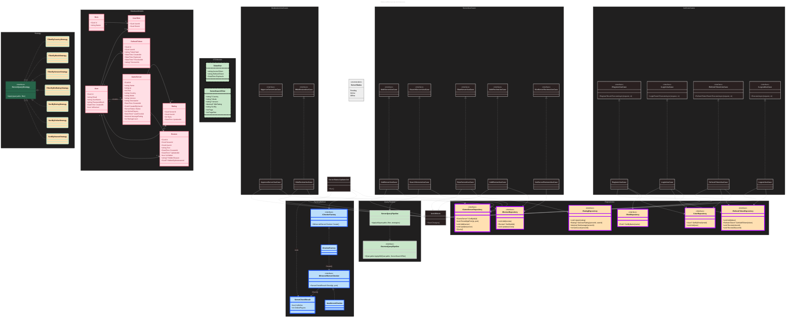

```mermaid
---
config:
  theme: neo-dark
  look: classic
title: MinecraftServerList Architecture
---
classDiagram
direction TB
	namespace Repositories {
        class IGameServerRepository {
	        +GameServer? GetById(id)
	        +bool ExistsByIpPort(ip, port)
	        +void Add(server)
	        +void Update(server)
	        +Query()
        }

        class IRatingRepository {
	        +void Upsert(rating)
	        +Rating? GetUserRating(serverId, userId)
	        +decimal GetAverage(serverId)
	        +int GetCount(serverId)
        }

        class IReviewRepository {
	        +void Add(review)
	        +Review? GetById(id)
	        +void Update(review)
        }

        class IRoleRepository {
	        +Role? GetByName(name)
        }

        class IUserRepository {
	        +User? GetByEmail(email)
	        +void Add(user)
        }

        class IRefreshTokenRepository {
	        +void Add(token)
	        +RefreshToken? GetValidToken(token)
	        +void Revoke(tokenId)
	        +void RevokeAll(userId)
        }

	}
	namespace Strategy {
        class IServerQueryStrategy {
	        +Apply(queryable, filter)
        }

        class FilterByCountryStrategy {
        }

        class FilterByModeStrategy {
        }

        class FilterByVersionStrategy {
        }

        class FilterByMinRatingStrategy {
        }

        class SortByRatingStrategy {
        }

        class SortByOnlineStrategy {
        }

        class SortByNewestStrategy {
        }

	}
	namespace FactoryMethod {
        class ICheckerFactory {
	        +IMinecraftServerChecker Create()
        }

        class CheckerFactory {
        }

        class IMinecraftServerChecker {
	        +ServerCheckResult Check(ip, port)
        }

        class ServerCheckResult {
	        +bool IsOnline
	        +int OnlinePlayers
        }

        class JavaServerChecker {
        }

	}
	namespace DatabaseModels {
        class Role {
	        +Guid Id
	        +string Name
        }

        class User {
	        +Guid Id
	        +string Email
	        +string UserName
	        +string PasswordHash
	        +DateTime CreatedAt
	        +bool IsBlocked
        }

        class RefreshToken {
	        +Guid Id
	        +Guid UserId
	        +string TokenHash
	        +DateTime CreatedAt
	        +DateTime ExpiresAt
	        +DateTime? RevokedAt
	        +string? DeviceInfo
        }

        class GameServer {
	        +Guid Id
	        +string Name
	        +string Ip
	        +int Port
	        +string Country
	        +string Mode
	        +string Version
	        +string Description
	        +DateTime CreatedAt
	        +Guid CreatedByUserId
	        +ServerStatus Status
	        +int OnlinePlayers
	        +DateTime? LastCheckAt
	        +decimal AverageRating
	        +int RatingsCount
        }

        class Review {
	        +Guid Id
	        +Guid ServerId
	        +Guid UserId
	        +string Text
	        +DateTime CreatedAt
	        +DateTime? UpdatedAt
	        +bool IsHidden
	        +string? HiddenReason
	        +Guid? HiddenByModeratorId
        }

        class UserRole {
	        +Guid UserId
	        +Guid RoleId
        }

        class Rating {
	        +Guid ServerId
	        +Guid UserId
	        +int Stars
	        +DateTime UpdatedAt
        }

	}
	namespace DTOModels {
        class TokenPair {
	        +string AccessToken
	        +string RefreshToken
	        +DateTime ExpiresAt
        }

        class ServerSearchFilter {
	        +string? Country
	        +string? Mode
	        +string? Version
	        +decimal? MinRating
	        +string SortBy
	        +int Page
	        +int PageSize
        }

	}
	namespace QueryPipeline {
        class ServerQueryPipeline {
	        +ApplyAll(queryable, filter, strategies)
        }

        class ISevrverQueryPipeline {
	        +IQueryable ApplyAll(IQueryable, ServerSearchFilter)
        }

	}
	namespace AuthUseCases {
        class IRegisterUseCase {
	        +RegisterResult ExecuteAsync(request, ct)
        }

        class RegisterUseCase {
        }

        class ILoginUseCase {
	        +LoginResult ExecuteAsync(request, ct)
        }

        class LoginUseCase {
        }

        class IRefreshTokenUseCase {
	        +RefreshTokenResult ExecuteAsync(request, ct)
        }

        class RefreshTokenUseCase {
        }

        class ILogoutUseCase {
	        +ExecuteAsync(request, ct)
        }

        class LogoutUseCase {
        }

	}
	namespace ServerUseCases {
        class IAddServerUseCase {
        }

        class AddServerUseCase {
        }

        class ISearchServersUseCase {
        }

        class SearchServersUseCase {
        }

        class IRateServerUseCase {
        }

        class RateServerUseCase {
        }

        class IAddReviewUseCase {
        }

        class AddReviewUseCase {
        }

        class IGetServerReviewsUseCase {
        }

        class GetServerReviewsUseCase {
        }

	}
	namespace ModerationUseCases {
        class IApproveServerUseCase {
        }

        class ApproveServerUseCase {
        }

        class IHideReviewUseCase {
        }

        class HideReviewUseCase {
        }

	}
    class ServerStatus {
	    Pending
	    Online
	    Offline
    }

    class UnitOfWork {
	    +SaveChanges()
    }

    class ServerStatusUpdaterJob {
	    +Run()
    }

	<<interface>> IGameServerRepository
	<<interface>> IRatingRepository
	<<interface>> IReviewRepository
	<<interface>> IRoleRepository
	<<interface>> IUserRepository
	<<interface>> IRefreshTokenRepository
	<<interface>> IServerQueryStrategy
	<<interface>> ICheckerFactory
	<<interface>> IMinecraftServerChecker
	<<interface>> ISevrverQueryPipeline
	<<interface>> IRegisterUseCase
	<<interface>> ILoginUseCase
	<<interface>> IRefreshTokenUseCase
	<<interface>> ILogoutUseCase
	<<interface>> IAddServerUseCase
	<<interface>> ISearchServersUseCase
	<<interface>> IRateServerUseCase
	<<interface>> IAddReviewUseCase
	<<interface>> IGetServerReviewsUseCase
	<<interface>> IApproveServerUseCase
	<<interface>> IHideReviewUseCase
	<<enumeration>> ServerStatus

    User "1" --> "0..*" UserRole
    Role "1" --> "0..*" UserRole
    User "1" --> "0..*" RefreshToken
    User "1" --> "0..*" GameServer : creates
    GameServer "1" --> "0..*" Rating
    User "1" --> "0..*" Rating
    GameServer "1" --> "0..*" Review
    User "1" --> "0..*" Review
    IRegisterUseCase <|.. RegisterUseCase
    ILoginUseCase <|.. LoginUseCase
    IRefreshTokenUseCase <|.. RefreshTokenUseCase
    ILogoutUseCase <|.. LogoutUseCase
    IAddServerUseCase <|.. AddServerUseCase
    ISearchServersUseCase <|.. SearchServersUseCase
    IRateServerUseCase <|.. RateServerUseCase
    IAddReviewUseCase <|.. AddReviewUseCase
    IGetServerReviewsUseCase <|.. GetServerReviewsUseCase
    IApproveServerUseCase <|.. ApproveServerUseCase
    IHideReviewUseCase <|.. HideReviewUseCase
    IServerQueryStrategy <|.. FilterByCountryStrategy
    IServerQueryStrategy <|.. FilterByModeStrategy
    IServerQueryStrategy <|.. FilterByVersionStrategy
    IServerQueryStrategy <|.. FilterByMinRatingStrategy
    IServerQueryStrategy <|.. SortByRatingStrategy
    IServerQueryStrategy <|.. SortByOnlineStrategy
    IServerQueryStrategy <|.. SortByNewestStrategy
    RegisterUseCase --> IUserRepository
    RegisterUseCase --> IRoleRepository
    RegisterUseCase --> UnitOfWork
    LoginUseCase --> IUserRepository
    LoginUseCase --> IRefreshTokenRepository
    LoginUseCase --> UnitOfWork
    RefreshTokenUseCase --> IRefreshTokenRepository
    RefreshTokenUseCase --> IUserRepository
    RefreshTokenUseCase --> UnitOfWork
    LogoutUseCase --> IRefreshTokenRepository
    LogoutUseCase --> UnitOfWork
    AddServerUseCase --> IGameServerRepository
    AddServerUseCase --> UnitOfWork
    SearchServersUseCase --> IGameServerRepository
    SearchServersUseCase --> ServerQueryPipeline
    RateServerUseCase --> IRatingRepository
    RateServerUseCase --> UnitOfWork
    AddReviewUseCase --> IReviewRepository
    AddReviewUseCase --> UnitOfWork
    GetServerReviewsUseCase --> IReviewRepository
    ApproveServerUseCase --> IGameServerRepository
    ApproveServerUseCase --> UnitOfWork
    HideReviewUseCase --> IReviewRepository
    HideReviewUseCase --> UnitOfWork
    ICheckerFactory <|.. CheckerFactory
    IMinecraftServerChecker <|.. JavaServerChecker
    CheckerFactory ..> IMinecraftServerChecker : Create()
    IMinecraftServerChecker --> ServerCheckResult : Check()
    ServerStatusUpdaterJob --> IGameServerRepository
    ServerStatusUpdaterJob --> ICheckerFactory
    ServerStatusUpdaterJob --> UnitOfWork
    ServerStatusUpdaterJob ..> ServerCheckResult : uses
    ServerQueryPipeline ..|> ISevrverQueryPipeline

	class IGameServerRepository:::Class_04
	class IRatingRepository:::Class_04
	class IReviewRepository:::Class_04
	class IRoleRepository:::Class_04
	class IUserRepository:::Class_04
	class IRefreshTokenRepository:::Class_04
	class IServerQueryStrategy:::Pine
	class FilterByCountryStrategy:::Class_01
	class FilterByModeStrategy:::Class_01
	class FilterByVersionStrategy:::Class_01
	class FilterByMinRatingStrategy:::Class_01
	class SortByRatingStrategy:::Class_01
	class SortByOnlineStrategy:::Class_01
	class SortByNewestStrategy:::Class_01
	class ICheckerFactory:::Class_02
	class CheckerFactory:::Class_02
	class IMinecraftServerChecker:::Class_02
	class ServerCheckResult:::Class_02
	class JavaServerChecker:::Class_02
	class Role:::Rose
	class User:::Rose
	class RefreshToken:::Rose
	class GameServer:::Rose
	class Review:::Rose
	class UserRole:::Rose
	class Rating:::Rose
	class TokenPair:::Class_05
	class ServerSearchFilter:::Class_05
	class ServerQueryPipeline:::Class_07
	class ISevrverQueryPipeline:::Class_07
	class ServerStatus:::Ash

	classDef Pine :,fill:#27654A,stroke:#254336,color:#FFFFFF,stroke-width:1px
	classDef Class_01 :,fill:#FFE0B2,stroke:#C8E6C9,color:#000000,stroke-width:4px
	classDef Rose :,fill:#FFDFE5,stroke:#FF5978,color:#8E2236,stroke-width:1px
	classDef Ash :,fill:#EEEEEE,stroke:#999999,color:#000000,stroke-width:1px
	classDef Class_02 :,fill:#BBDEFB,stroke:#2962FF,color:#000000,stroke-width:4px
	classDef Class_04 :,fill:#FFE0B2,stroke:#AA00FF,color:#000000,stroke-width:4px
	classDef Class_05 :,fill:#C8E6C9,stroke:#000000,color:#000000,stroke-width:4px,stroke-dasharray:5,fill:#C8E6C9,stroke:#000000,color:#000000,stroke-width:4px,stroke-dasharray:5
	classDef Class_07 :,fill:#C8E6C9,color:#000000,stroke-width:2px
```
